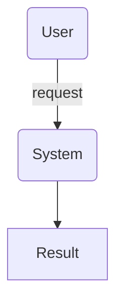
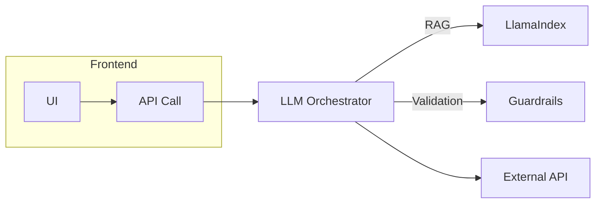

# Phase 2 – Solution Sketch Guide

*Scope: ≤ 1 working day*

> **Goal:** Transform the Feasibility Spike into a high-level, **buildable** architecture and an actionable backlog—still minimal, still reversible.

---

## 1 Prerequisites

* **GO** decision recorded in `spike_report.md`
* Filled `preflight.json`
* Sample data & spike prompt available

---

## 2 Deliverables

| Artifact                    | File / Location                   | Description                                                                |
| --------------------------- | --------------------------------- | -------------------------------------------------------------------------- |
| **`solution_sketch.md`**    | `/planning/`                      | Text + Mermaid diagrams that capture data flow, components, and interfaces |
| **`tech_matrix.tsv`**       | `/planning/`                      | Rows: Concern · Option · Decision · Rationale                              |
| **`backlog.tsv` (updated)** | root                              | Tasks decomposed to ≤ 0.5-day effort                                       |
| **Repo skeleton**           | `/src /tests /planning /spikes`   | Empty dirs committed with `.gitkeep`                                       |
| **CI harness**              | `.github/workflows/ci.yml` (stub) | Runs lint + tests (even if tests empty)                                    |

---

## 3 Time-boxed Schedule (≈ 6 hours)

| hh:mm      | Activity                                                   |
| ----------- | ---------------------------------------------------------- |
| 00:00–00:30 | Re-read spike findings & success metric                    |
| 00:30–01:30 | Draft **user journey diagram** + **data flow** (Mermaid)   |
| 01:30–02:00 | Decide **runtime stack** & helper library (only 1)         |
| 02:00–03:00 | Fill `tech_matrix.tsv` (lang, hosting, storage, auth, lib) |
| 03:00–04:00 | Break system into modules (≤ 400 LOC each); add to backlog |
| 04:00–04:30 | Scaffold repo folders, placeholder files, CI stub          |
| 04:30–05:30 | Peer/self review: check decisions vs constraints           |
| 05:30–06:00 | Commit artifacts, tag `v0.1-sketch`                        |

---

## 4 Templates

### 4.1 `solution_sketch.md`

```markdown
# Solution Sketch – {project_name}

## 1. Overview
Value Prop: {copy from preflight}
Success Metric: {copy}

## 2. User Journey (happy path)


## 3. Data Flow



## 4. Component Responsibilities

| Component    | Responsibility | Language |
|-------------|----------------|----------|
| Orchestrator | ...           | Python   |
| Retriever    | ...           | Python   |

## 5. Key Decisions

* Language: Python 3.12
* Helper Library: LangGraph 0.6
* Hosting: Fly.io

## 6. Open Questions

* …
```

### 4.2 `tech_matrix.tsv`
```

Concern	Option	Decision	Rationale
Language	Python | TypeScript	Python	Faster for AI libs
Orchestration	None | LangGraph | AutoGen	LangGraph	Branching logic
Storage	None | SQLite | Postgres	SQLite	Single-file, cheap

```

### 4.3 Backlog row example
```

ID	Title	DoD	ETA (h)
M1	Set up repo & CI	CI runs lint+tests green	1

```

---
## 5 Acceptance Checklist
- [ ] `solution_sketch.md` committed & reviewed
- [ ] `tech_matrix.tsv` completed
- [ ] Repo skeleton & CI stub pushed
- [ ] Backlog decomposed (no task > 4 h)
- [ ] Open questions flagged for Phase 3

---
## 6 Exit Criteria → Phase 3 (Repo Scaffold & Lo-fi Prototype)
Proceed when:
1. All items above are **green**
2. No critical open questions remain
3. Stakeholder (could be just you) signs off on decisions

---
**Tip:** keep decisions lightweight and reversible—Phase 2 is still a thinking phase, not full implementation.

```
